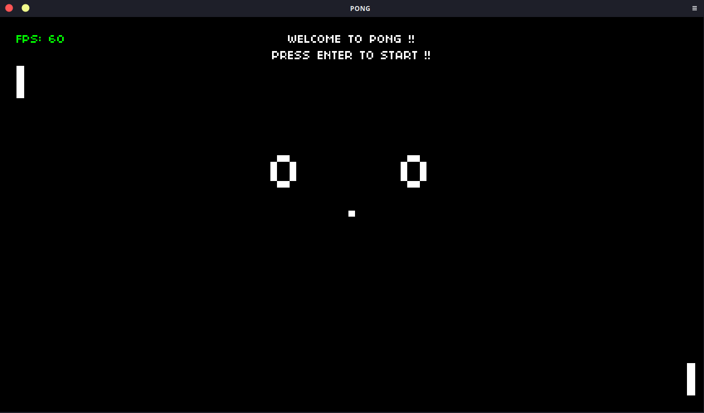
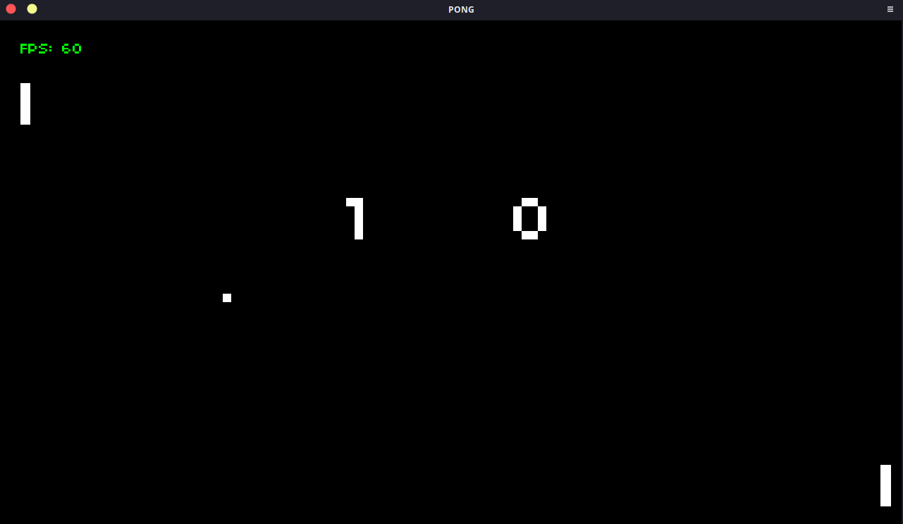
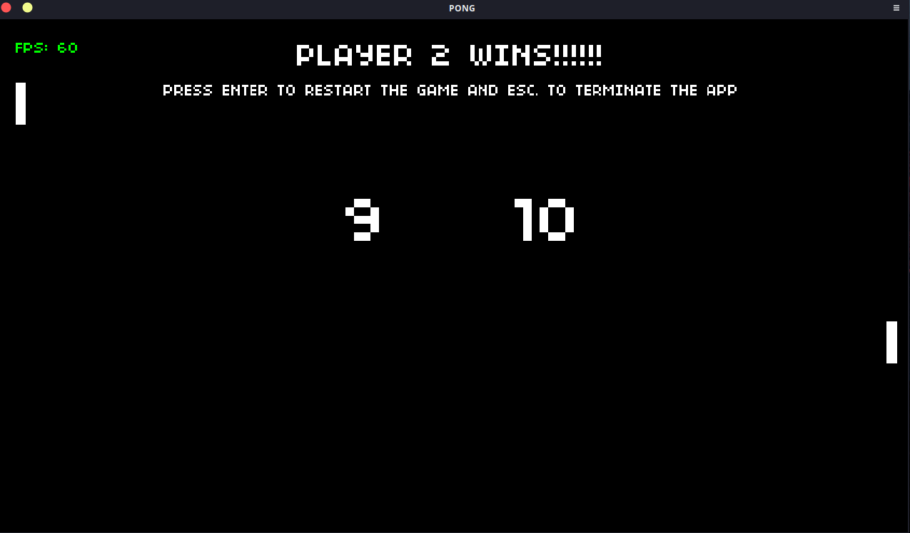

## Retro Pong
Pong is a table tennis–themed arcade sports video game, featuring simple two-dimensional graphics.

This project is one of the earliest ones I've made to get familiar with **Lua** and **Löve**. It facilitated the usage of fundamental constructs such as modules, classes, inheritance etc. using Lua.

## How does the game work?
- The player controls an in-game paddle by moving it vertically across the left or right side of the screen.
- They compete against another player controlling a second paddle on the opposing side.
- Players use the paddles to hit a ball back and forth. 
- The goal is for each player to reach ten points before the opponent; points are earned when one fails to return the ball to the other.

#### Welcome screen

#### Pong in action

#### A player wins
